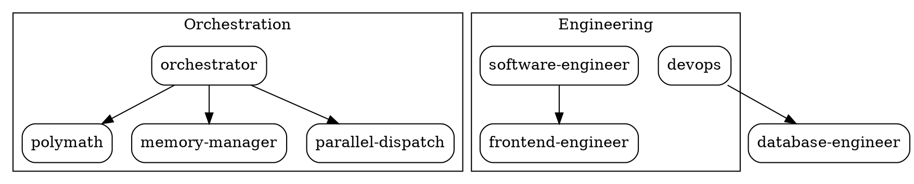

# Forgewright Dependency Management Protocol

> **Version:** 1.0.0
> **Created:** 2026-05-29
> **Phase:** 3.4
> **Status:** Implementation

---

## Overview

This document defines the protocol for managing, visualizing, and analyzing skill dependencies in Forgewright. It ensures that skill relationships are well-understood, circular dependencies are prevented, and changes can be assessed for impact before implementation.

---

## Dependency Types

### 1. Direct Dependencies

A skill **A** directly depends on skill **B** if:

- Skill **A** references skill **B** in its `SKILL.md` file
- Skill **A** invokes skill **B** through the orchestrator
- Skill **A** includes skill **B**'s protocol in its workflow

```markdown
<!-- In skills/a Skill/SKILL.md -->
> **Protocol:** [Example Protocol](skills/_shared/protocols/example.md)
> **Skill:** [Other Skill](skills/other-skill/SKILL.md)
```

### 2. Transitive Dependencies

A skill **A** transitively depends on skill **C** if:
- Skill **A** depends on skill **B**
- Skill **B** depends on skill **C**

### 3. Protocol Dependencies

A skill depends on a protocol if:
- The skill references the protocol in its documentation
- The skill's workflow requires the protocol's procedures

### 4. Script Dependencies

A skill depends on a script if:
- The skill references the script in its documentation
- The skill's workflow requires the script's functionality

---

## Dependency Graph Format

### Node Format

```json
{
  "id": "skill-name",
  "type": "skill",
  "label": "Skill Name",
  "category": "engineering",
  "version": "1.0.0"
}
```

### Edge Format

```json
{
  "source": "skill-a",
  "target": "skill-b",
  "type": "direct",
  "label": "uses"
}
```

### Full Graph Format

```json
{
  "generated": "2026-05-29T00:00:00Z",
  "nodes": [...],
  "edges": [...],
  "metadata": {
    "total_skills": 68,
    "total_dependencies": 142,
    "circular_dependencies": []
  }
}
```

---

## Circular Dependency Detection

### Algorithm

```
1. Build adjacency list from dependency graph
2. For each node, perform DFS with coloring:
   - WHITE: Unvisited
   - GRAY: Currently visiting (in recursion stack)
   - BLACK: Fully processed
3. If we encounter a GRAY node during DFS, we found a cycle
4. Report all detected cycles
```

### Cycle Resolution

When a circular dependency is detected:

1. **Identify the cycle path**
2. **Evaluate severity:**
   - Direct cycle (A→B→A): CRITICAL - must resolve immediately
   - Indirect cycle (A→B→C→A): HIGH - should resolve before release
3. **Resolution strategies:**
   - Extract shared functionality into a new skill/protocol
   - Create interface abstraction layer
   - Refactor to use event-driven communication
   - Break dependency by making one skill optional

---

## Impact Analysis

### Change Impact Assessment

When modifying a skill, assess impact on:

| Change Type | Impact Radius |
|-------------|---------------|
| Remove skill | All skills depending on it (directly or transitively) |
| Rename skill | All references in other skills, AGENTS.md, CLAUDE.md |
| Change protocol | All skills using that protocol |
| Change script | All skills referencing that script |

### Blast Radius Calculation

```bash
# For a given skill, calculate blast radius
affected_skills = get_direct_dependents(skill)
for dependent in affected_skills:
    affected_skills += get_transitive_dependents(dependent)
```

---

## Dependency Graph Visualization

### ASCII Format

```
┌──────────────────────────────────────────────────────────────────────┐
│                    FORGEWRIGHT SKILL DEPENDENCIES                    │
├──────────────────────────────────────────────────────────────────────┤
│                                                                      │
│  orchestrator                                                        │
│      │                                                               │
│      ├── polymath                                                    │
│      │   └── goal-driven                                            │
│      │                                                               │
│      ├── memory-manager                                              │
│      │   └── skill-maker                                             │
│      │                                                               │
│      ├── parallel-dispatch                                           │
│      │                                                               │
│      └── mcp-generator                                              │
│                                                                      │
│  engineering                                                         │
│      ├── software-engineer ──┐                                      │
│      │                        │                                      │
│      ├── frontend-engineer ───┴── fullstack                          │
│      │                                                               │
│      ├── code-quality-engineer (debugger, code-reviewer, qa-engineer)│
│      │                                                               │
│      ├── devops                                                      │
│      │   ├── sre                                                    │
│      │   └── database-engineer                                       │
│      │                                                               │
│      └── mobile-engineer                                             │
│                                                                      │
└──────────────────────────────────────────────────────────────────────┘
```

### GraphViz DOT Format



---

## Dependency Management Rules

### Rule 1: No Direct Cycles

**Requirement:** No skill may directly or transitively depend on itself.

```bash
# Verify no cycles before committing
./scripts/dep-graph.sh --check-cycles
```

### Rule 2: Document Dependencies

**Requirement:** All skill dependencies must be documented in SKILL.md.

```markdown
## Dependencies

- [protocol-name](skills/_shared/protocols/protocol-name.md) - Purpose
- [skill-name](skills/skill-name/SKILL.md) - Reason for dependency
```

### Rule 3: Minimize Coupling

**Requirement:** Skills should depend on interfaces (protocols) rather than implementations (other skills) when possible.

### Rule 4: Version Compatibility

**Requirement:** When a skill depends on another, specify version compatibility.

```yaml
# In SKILL.md frontmatter
dependencies:
  - skill: protocol-name
    version: ">=1.0.0"
  - skill: other-skill
    version: "~2.3.0"
```

---

## Implementation

See `scripts/dep-graph.sh` for automated dependency graph generation.

## Usage

```bash
# Generate dependency graph
./scripts/dep-graph.sh generate

# Check for circular dependencies
./scripts/dep-graph.sh check-cycles

# Analyze impact of changing a skill
./scripts/dep-graph.sh impact <skill-name>

# Export graph in various formats
./scripts/dep-graph.sh export dot
./scripts/dep-graph.sh export json
./scripts/dep-graph.sh export mermaid
```

---

*Document Version: 1.0.0*
*Last Updated: 2026-05-29*
