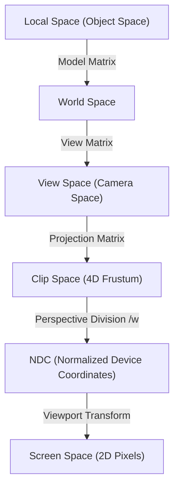

# 3D Spatial & Blockout Foundations — Shared Reference

> **Mọi game skill (level designer, technical artist, engine engineers, web-3d specialist) đều tham chiếu document này.** Cung cấp nền tảng toán học hệ tọa độ, quy trình dựng khối blockout, và các kỹ thuật tối ưu hóa hiệu năng 3D.

---

## 1. Nguyên lý Thiết kế & Sắp xếp Không gian 3D (3D Space Layout)

Thiết kế không gian 3D trong game đòi hỏi sự kết hợp chặt chẽ giữa tính dễ đọc (legibility), công thái học, và điều hướng tự nhiên (Wayfinding):

### 1.1 Điều hướng bằng Thị giác (Visual Wayfinding)
Hạn chế tối đa việc cầm tay chỉ việc bằng các ký hiệu UI ảo (minimap, mũi tên 2D). Thay vào đó, sử dụng các công cụ dẫn dắt tự nhiên:
*   **Ánh sáng & Tương phản (Lighting Contrast)**: Mắt người luôn hướng về nơi có ánh sáng. Đặt nguồn sáng mạnh ở cuối hành lang, trên cánh cửa chính, hoặc quanh mục tiêu cần đạt để dẫn lối người chơi.
*   **Màu sắc tương tác (Interactive Color Guidance)**: Dùng các vết màu nổi bật để biểu thị khu vực có thể tương tác (ví dụ: vết sơn vàng trên gờ tường leo trèo, viền đỏ trên các thùng thuốc nổ, tấm bạt trắng phủ trên vực có thể nhảy qua).
*   **Điểm mốc (Landmarks / "Weenies")**: Đặt các công trình kiến trúc khổng lồ, độc bản ở hậu cảnh (ví dụ: tòa tháp phát sáng, ngọn núi tuyết) làm tiêu điểm giúp người chơi tự định vị phương hướng trong không gian 3D.

### 1.2 Phân cấp Đường đi & Dòng chảy (Flow & Path Hierarchy)
*   **Đường chính vs Đường phụ**: Đường đi chính (critical path) cần rộng hơn, sáng hơn và có cấu trúc rõ ràng. Các đường phụ (optional path) chứa bí mật nên khuất sau các chướng ngại vật hoặc có ánh sáng yếu hơn để kích thích tò mò.
*   **Tránh ngõ cụt (Avoid Dead Ends)**: Nếu người chơi rẽ vào một lối đi phụ, luôn đặt phần thưởng (loot, lore) ở đó. Tối ưu hơn là thiết kế các đường tắt dạng vòng lặp (looping shortcuts) dẫn người chơi quay lại đường chính mà không phải đi bộ ngược lại.
*   **Nhịp độ không gian (Spatial Pacing)**: Thiết kế xen kẽ các không gian chật hẹp (tạo áp lực, căng thẳng) với không gian rộng mở (giải phóng áp lực, tạo sự kinh ngạc trước cảnh quan).

---

## 2. Quy trình Dựng khối Blockout (Greyboxing)

**Blockout** (Greybox hoặc Blockmesh) là bản nháp 3D thô của màn chơi được dựng hoàn toàn bằng các hình khối cơ bản (primitives) để kiểm thử gameplay trước khi chuyển cho họa sĩ vẽ chi tiết.

### 2.1 Các Nguyên tắc Cốt lõi
*   **Thiết kế Thô trước (Keep it Cheap)**: Việc thay đổi, xóa bỏ hay dịch chuyển các hình khối xám trong giai đoạn blockout là rất nhanh và không tốn chi phí. Việc phải bỏ đi các tài nguyên art đã vẽ chi tiết do phát hiện lỗi cấu trúc màn chơi muộn là cực kỳ lãng phí.
*   **Thước đo Nhân vật (Humanoid Metrics)**: Luôn đặt ít nhất một hình nhân tỷ lệ (scale figure) cao khoảng 1.7m – 1.8m trong khung nhìn.
    - Chiều cao tường tiêu chuẩn: 150% - 200% chiều cao nhân vật.
    - Chiều rộng lối đi: Đảm bảo độ rộng gấp đôi chiều rộng va chạm (collision width) của nhân vật để tránh cảm giác bị kẹt.
*   **Thực nghiệm Vật lý (Playtest in-engine)**: Không bao giờ đánh giá màn chơi chỉ bằng cách bay camera trong editor. Bắt buộc phải điều khiển nhân vật chạy, nhảy, trượt trực tiếp trên khối va chạm để cảm nhận nhịp chuyển động (flow).

### 2.2 Các Phương pháp Xây dựng (Construction Methods)
1.  **Primitives**: Xếp và kéo dãn các khối cơ bản (Cubes, Cylinders, Ramps). Phù hợp cho kiến trúc vuông vức.
2.  **Brushes / Low-Poly Modeling**: Thiết kế lưới trực tiếp trong editor (ProBuilder trong Unity, Modeling Tools trong Unreal). Thiết lập kích thước lưới (grid size) tương thích với collision width của nhân vật để đảm bảo độ chuẩn xác về metric.
3.  **Modular Kits**: Sử dụng các mảnh ghép module (tường, sàn, cột) snapping chặt chẽ vào lưới grid để tăng tốc độ dựng cảnh.
4.  **Splines**: Dùng các đường cong toán học không phá hủy (non-destructive) để tự sinh địa hình đường đi, sông ngòi, cầu cống.

---

## 3. Hệ tọa độ & Toán học Chuyển đổi (Transforms & Mathematics)

Quy trình hiển thị các đỉnh (vertices) 3D từ phần mềm đồ họa lên màn hình 2D phẳng của người chơi đi qua chuỗi chuyển đổi ma trận sau:

### 3.1 Chuỗi Chuyển đổi Ma trận (Matrix Pipeline)
Công thức biến đổi một đỉnh từ tọa độ cục bộ sang tọa độ clip:
$$\mathbf{V_{clip}} = \mathbf{M_{projection}} \cdot \mathbf{M_{view}} \cdot \mathbf{M_{model}} \cdot \mathbf{V_{local}}$$

*   **Ma trận Mô hình ($M_{model}$)**: Định vị vật thể từ hệ tọa độ của chính nó (Local Space) vào không gian thế giới (World Space) thông qua các phép tịnh tiến (Translation), quay (Rotation), và tỷ lệ (Scale).
*   **Ma trận Khung nhìn ($M_{view}$)**: Dịch chuyển và quay toàn bộ thế giới theo hướng ngược lại với chuyển động mong muốn của Camera, biến đổi tọa độ thế giới sang hệ tọa độ của Camera (View Space).
*   **Ma trận Phép chiếu ($M_{projection}$)**: Xác định thể tích nhìn thấy (frustum).
    - Phép chiếu trực giao (Orthographic): Giữ nguyên kích thước vật thể bất kể khoảng cách (dùng cho 2D hoặc bản vẽ kỹ thuật).
    - Phép chiếu phối cảnh (Perspective): Thu nhỏ các vật thể ở xa thông qua chia trục $w$ (Homogeneous coordinate).
*   **Perspective Division**: Bước phần cứng tự động chia các thành phần $x, y, z$ cho $w$ để chuyển từ ma trận 4D Clip Space về 3D Normalized Device Coordinates (NDC, giá trị từ $-1.0$ đến $1.0$).

### 3.2 Cây Cấu trúc Cảnh (Scene Graph Hierarchies)
*   **Local Transform**: Mỗi nút (node) trong Scene Graph chỉ lưu trữ ma trận biến đổi tương đối so với nút cha của nó (Parent).
*   **Global Transform**: Tọa độ tuyệt đối của nút con trong World Space được tính bằng cách nhân tích các ma trận Local Transform từ nút con ngược lên nút gốc (Root).
*   **Hierarchy Detachment**: Khi tháo một vật thể $L$ khỏi cha cũ $E$ để gắn vào cha mới $G$ mà không muốn thay đổi vị trí tuyệt đối của nó trong thế giới, ma trận biến đổi local mới ($T'_L$) phải được tính lại bằng công thức:
    $$T'_L = \mathbf{T_G^{-1}} \cdot \mathbf{T_{world\_global\_of\_L}}$$

---

## 4. Tối ưu hóa Hiệu năng dựng hình 3D (3D Render Optimization)

Để duy trì tốc độ khung hình mượt mà (30 - 60+ FPS), bắt buộc phải tối ưu hóa CPU (giảm draw calls) và GPU (giảm vertex/pixel overhead):

### 4.1 Cơ chế Loại bỏ Dựng hình (Culling)
*   **Frustum Culling (Loại bỏ theo hình nêm)**: CPU tự động bỏ qua việc vẽ các vật thể nằm ngoài góc nhìn của Camera.
*   **Occlusion Culling (Loại bỏ theo vật cản)**: Bỏ qua các vật thể bị che khuất hoàn toàn sau các cấu trúc lớn (như bức tường, ngọn núi). Cần cấu hình trước khu vực occlusion cells để tối ưu.
*   **Distance Culling**: Không dựng các vật thể nhỏ/vụn vặt khi chúng ở khoảng cách quá xa so với Camera.

### 4.2 Tối ưu hình học (Geometry & Texture Optimization)
*   **Mesh LOD (Level of Detail)**: Tự động tráo đổi các phiên bản mô hình có số lượng polygon giảm dần khi khoảng cách tới Camera tăng lên.
*   **Gộp lô vẽ (Batching)**: Gộp các vật thể sử dụng chung một Material thành một lượt vẽ duy nhất để tránh CPU bị nghẽn (Static Batching cho vật thể tĩnh, Dynamic Batching cho vật thể chuyển động).
*   **Texture Atlas (Bản đồ kết cấu)**: Ghép nhiều hình ảnh texture lẻ của nhiều vật thể vào chung một tấm hình lớn. Nhờ đó, các vật thể này có thể dùng chung một Material và được gộp lô vẽ (batched).
*   **Mipmaps**: Tạo sẵn các phiên bản thu nhỏ độ phân giải của texture để tải khi ở xa, giúp tiết kiệm băng thông nhớ và chống răng cưa texture.

### 4.3 Tối ưu hóa Ánh sáng (Lightmap Baking)
*   Ánh sáng động (Dynamic lights) tiêu tốn nhiều tài nguyên GPU để tính toán đổ bóng thời gian thực.
*   **Light Baking**: Tính toán sẵn bóng đổ và ánh sáng tĩnh rồi lưu (nướng) trực tiếp vào một texture bề mặt (Lightmap). Sau khi nướng, vô hiệu hóa các bóng đổ động không cần thiết để giảm tải draw calls.

### 4.4 Phân luồng Màn chơi (Level Streaming)
*   Chia bản đồ lớn thành các phân vùng nhỏ (sublevels). Dùng các trigger ẩn trong màn chơi để nạp (load) hoặc giải phóng (unload) sublevel khỏi RAM theo bước di chuyển của người chơi.
*   Tránh việc nạp toàn bộ thế giới cùng một lúc gây tràn bộ nhớ thiết bị.
